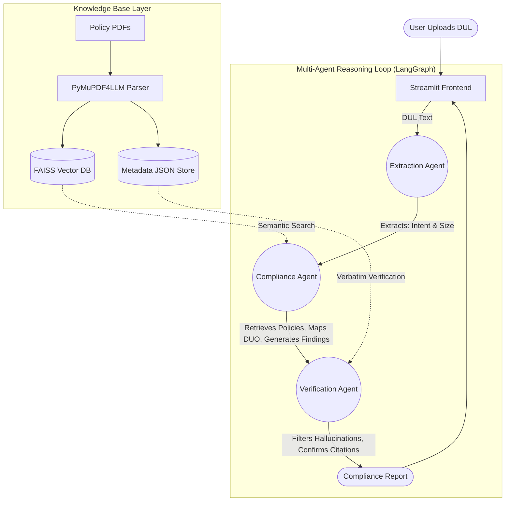

# Machine-Verifiable Compliance PoC
**Multi-Agent Reasoning Loop Architecture**

This repository contains a Proof of Concept (PoC) for an automated compliance verification system. It leverages a multi-agent AI architecture to ingest, read, and verify Data Use Letters (DULs) against regulatory frameworks (such as the GA4GH Framework and NIH Genomic Data Sharing Policy).

---

## What it Does

This PoC automatically determines if a researcher's proposed study complies with the governing regulations and Data Use Ontology (DUO). 

1. **Intelligent Extraction:** Automatically extracts context (like the "Research Intent" and "Sample Size") from plain text proposals.
2. **Dynamic Policy Retrieval:** Dynamically retrieves relevant clauses from ingested policy documents, triggered by specific thresholds (e.g., sample sizes > 100 force rigorous tracking).
3. **Machine-Readable Tagging:** Automatically maps plain text intent to formal DUO terms (e.g., mapping "cancer" to `DUO:0000007`).
4. **Anti-Hallucination Guardrails:** Utilizes a separate Verification Agent that mathematically grounds every AI citation against the original regulatory PDFs, ensuring 100% citation accuracy.

> **Important Note for Production Environment:** 
> For the purposes of this PoC, **PyMuPDF4LLM** has been used as a lightweight, local solution to parse PDFs into hierarchical markdown. 
> 
> *In the full production build, this parsing engine will be entirely replaced by **LlamaParse (LlamaIndex)*** to handle complex enterprise document layouts, tables, and nested structures with superior accuracy.

---

## Architecture & Component Diagram

This project utilizes a **LangGraph State Machine** to coordinate three independent agents.



---

## How to Walk Through the Project

To evaluate this PoC, follow these steps:

### 1. Prerequisites and Setup
Ensure you have an active Groq API Key. 
```bash
# Clone the repository and navigate into it
# Install the necessary requirements
pip install -r requirements.txt

# Create a .env file and add your Groq API Key
echo "GROQ_API_KEY=your_actual_key_here" > .env
```

### 2. Prepare the Knowledge Base
To simulate the backend memory, we must download the base regulatory policies (GA4GH + NIH GDS) and index them.
```bash
# Download sample policies and build the FAISS index + Metadata JSON
python backend/build_index.py
```
*Note: You will see "Index build complete!" once successful.*

### 3. Launch the Application
Run the orchestrator script to spin up the FastAPI backend and Streamlit frontend concurrently.
```bash
python run.py
```
*Navigate to `http://localhost:8501` in your browser.*

---

## Sample Inputs and Expected Outputs for Evaluation

To test the system's dynamic reasoning, try the following sample prompts directly in the Streamlit UI or by looking at the evaluation benchmark (`python benchmark.py`).

### Scenario 1: Small-Scale Local Study
**Sample Input:**
> "We are conducting a local study on 50 patients with breast cancer."

**Expected Output & Reasoning Trace:**
1. **Extraction:** Intent="breast cancer", Sample Size=50.
2. **DUO Mapping:** Successfully maps "cancer" to `DUO:0000007 (Disease specific research)`.
3. **Threshold Check:** Detects sample size is `<= 100`. Performs standard policy retrieval without forcing strict NIH large-scale tracking.
4. **Verification:** Grounds any policy findings accurately.

### Scenario 2: Large-Scale International Study (Threshold Trigger)
**Sample Input:**
> "This is an international cardiovascular heart study involving 150 participants aiming to share genomic data."

**Expected Output & Reasoning Trace:**
1. **Extraction:** Intent="cardiovascular heart study", Sample Size=150.
2. **DUO Mapping:** Maps "heart" to `DUO:0000007`.
3. **Threshold Check:** Detects sample size is `> 100`. **The agent explicitly forces retrieval of the NIH Genomic Data Sharing guidelines** for large-scale data.
4. **Findings:** Identifies gaps stating the researcher must adhere to strict DBGaP submission requirements.

### Scenario 3: Hallucination Filtering (Internal Benchmark)
Run the automated test suite to see the Citation Verification agent in action:
```bash
python benchmark.py
```
**Expected Outcome:**
The script evaluates the Multi-Agent loop. If the Compliance Agent accidentally hallucinates a policy clause, the Verification Agent intercepts it, cross-references the `metadata_store.json`, and actively deletes the hallucinated citation, resulting in a **100% Citation Accuracy Score**.
